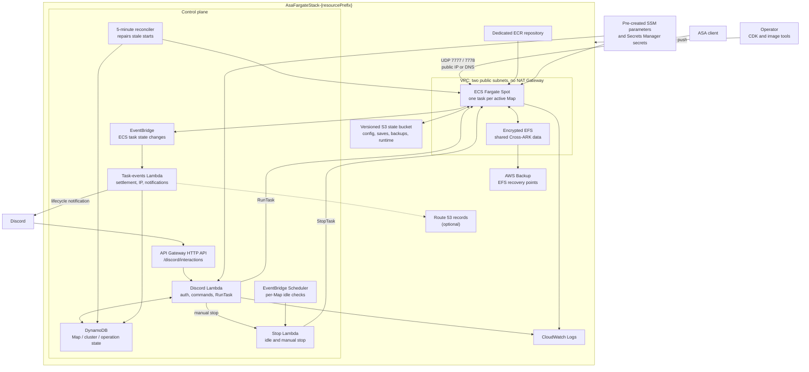

# ASA On Demand

ARK: Survival Ascended のプライベートサーバーを ECS Fargate Spot で起動し、Discord のスラッシュコマンドで操作する AWS CDK v2 プロジェクト。

[English](./README.md)

## インフラ全体像

1つの CloudFormation stackを、独立した1つの ASA cluster環境として扱う。常駐する ECS Service はなく、Discord commandを受けたときだけ選択したMapのFargate taskを起動し、手動停止・idle timeout・異常終了で停止する。各Mapは独立したtaskとS3 namespaceを持ち、Cross-ARK cluster dataだけをEFSで共有する。



### コンポーネントの責務

| 領域 | Resource | 責務 |
| --- | --- | --- |
| Entry point | API Gateway、Discord Lambda | Discord署名と権限を検証し、commandをdeferしてstart/stop/statusを調整する。 |
| Compute | ECS cluster、game task definition | ActiveなMapごとにpublic IP付きFargate taskを1つ起動する。Fargate Spotを優先し、on-demand fallbackは明示的に有効化する。 |
| Lifecycle | ECS events Lambda、stop Lambda、reconciler、Scheduler | Task stateの確定、接続先の通知、idle stop、staleなstart operationの復旧を行う。 |
| Persistent state | S3、DynamoDB、EFS | Map archive/runtime object、control-plane state、共有Cross-ARK dataをそれぞれ保存する。 |
| Image | Stack専用ECR repository | `asaBuildId`で選択するserver imageを保存し、最新2imageを保持する。 |
| Recovery | S3 versioning、AWS Backup | 過去のMap archiveを保持し、EFSのhourly/daily recovery pointを作る。 |
| Optional | Route 53、AWS Budgets | `<mapId>.<domain>` recordと、明示的に有効化した場合のcost alertを提供する。 |

### 起動から停止まで

1. `/asa start` が、DynamoDB上でMapとcluster concurrency slotをatomicに確保する。
2. Discord Lambdaが、選択したMap、session設定、S3 key、安定した`asaClusterId`を渡してFargate taskを起動する。
3. ContainerがそのMapのsaveをS3から復元し、EFSの共有Cross-ARK dataをmountし、共通設定とMap固有設定をoverlayしてProton経由でASAを起動する。
4. Heartbeatとready情報をMapのS3 namespaceへ書き込む。ECS task eventがDynamoDB、任意のDNS、Discord通知を更新する。
5. 手動停止またはidle判定でstop Lambdaを呼ぶ。Containerは終了前にworldを保存し、task-events Lambdaがruntimeとcost counterを確定する。

Load balancerとECS Serviceは存在しない。Clientはtaskのpublic IP、または任意のRoute 53 recordへ直接接続する。

## 環境とstateの境界

独立した環境ごとに`main`のような単純な`resourcePrefix`を使う。Map名や先頭・末尾の`/`は含めない。Applicationが内部のS3 prefixへ正規化する。`resourcePrefix=main`の場合:

- stack名は`AsaFargateStack-main`
- SSMとSecrets Managerは`/asa/main/...`
- log groupは`/asa/main/...`
- S3の永続objectは次のlayoutになる

```text
main/
├── config/
│   ├── common/                         # 全Mapへ適用
│   └── maps/<mapId>/                   # Map固有overlay
├── maps/<mapId>/
│   ├── saves/current.tar.zst           # Cross-ARK dataを含まないMap save
│   ├── backups/
│   └── runtime/                        # Heartbeat、ready、backup request
└── logs/
```

Stateの所有範囲は意図的に分けている。

| State | Store | Scope |
| --- | --- | --- |
| Map worldとlocal save | S3 archive | 1 Map |
| Cross-ARK survivor/tribute data | 暗号化EFS | 1 stack内の全Map |
| Active task、operation、runtime集計 | DynamoDB | 1 stack |
| Server image | ECR | 1 stack・1 build tag |

StackをdestroyしてもS3、EFS、DynamoDB、EFS backup vaultはretainされる。ECR imageとCloudWatch log groupは破棄可能なresourceとして扱う。S3のnoncurrent versionは7日で期限切れになり、EFS backupはデフォルトでhourlyを7日、dailyを35日保持する。

Cross-stack transferはサポートしない。

## 開発環境のセットアップ

必要なもの: Node.js 22以降、pnpm、Docker、AWS CLIの認証情報、対象serverへapplicationをinstallしてwebhookを作成できるDiscord account。

```bash
pnpm install
```

Repository commandにはnpmではなくpnpmを使う。検証commandは[コマンド](#コマンド)にまとめている。

### Discord Applicationの作成とInstall

Discord APIとこのrepositoryでは、Discord serverを*guild*と表記する。

1. [Discord Developer Portal](https://discord.com/developers/applications)を開き、**New Application**を選び、名前を入力してapplicationを作成する。
2. **General Information**で**Application ID**と**Public Key**をcopyする。**Interactions Endpoint URL**はAWS stackのdeployが終わるまで空のままにする。
3. **Bot**を開く。新規applicationにはbot userがすでに存在するため、**Token**の**Reset Token**からtokenを発行してcopyする。Tokenが表示されるのは発行時だけ。OAuth2 client secretと取り違えず、bot tokenをcommitしないこと。
4. **Installation**を開いてapplicationを設定する。
   - **Guild Install**を有効にする。このprojectでは**User Install**を使わない。
   - Install linkには**Discord Provided Link**を選ぶ。
   - **Default Install Settings**の**Guild Install**へ、`applications.commands`と`bot`のscopeを追加する。
   - Bot permissionとprivileged Gateway Intentは不要。CommandはHTTP interactions endpointで受信し、lifecycle通知にはwebhookを使う。
5. Install linkをcopyしてbrowserで開き、**Add to server**から対象serverを選ぶ。Server applicationのinstallにはDiscordの**Manage Server**権限が必要。
6. Discord clientの**User Settings > Advanced > Developer Mode**を有効にする。対象serverを右clickして**Copy Server ID**を選ぶ。操作を許可するmemberは右clickして**Copy User ID**、roleは**Server Settings > Roles**からrole IDをcopyする。Allowed userとallowed roleの少なくとも一方にはIDが必要。Copy操作が表示されない場合は[DiscordのID取得ガイド](https://support.discord.com/hc/en-us/articles/206346498-Where-can-I-find-my-User-Server-Message-ID)を参照する。
7. 通知用webhookはapplicationとは別に作成する。**Server Settings > Integrations > Webhooks**を開き、**Create Webhook**を選び、通知先channelを指定してwebhook URLをcopyする。このURLはsecretとして扱う。Discord公式の[webhookガイド](https://support.discord.com/hc/en-us/articles/228383668-Intro-to-Webhooks)にも同じserver側の手順がある。

取得した値とconfiguration templateの対応は次のとおり。

| Discordの値 | Templateの値 | AWSの保存先 |
| --- | --- | --- |
| Bot Token | `<discord bot token>` | Secrets Manager `/discord/bot-token` |
| 通知webhook URL | `<discord webhook url>` | Secrets Manager `/discord/notification-webhook-url` |
| Application ID | `<application id>` | SSM `/discord/application-id` |
| Public Key | `<public key>` | SSM `/discord/public-key` |
| Server ID | `<guild id>` | SSM `/discord/guild-id` |
| Role ID・user ID | `["123456789012345678"]`のようなJSON array | SSM `/discord/allowed-role-ids`・`/discord/allowed-user-ids` |

IDはJSON array内でもstringとして記載する。**Interactions Endpoint URL**の設定とguild commandの登録は、endpointとconfigurationを作成した後に[初回デプロイ](#初回デプロイ)で行う。

## 初回デプロイ

次の例では`main`環境を作る。Workflow全体で同じprofile、region、prefix、build IDを使う。Command lineのCDK contextは環境設定として保存されないため、以後のdeployでもすべての非default値を指定する。

1. Account・regionごとに1回だけCDKをbootstrapする。

   ```bash
   pnpm exec cdk bootstrap --profile my-aws-profile -c region=ap-northeast-1
   ```

2. Infrastructureをdeployする。この時点では参照するimage tagがなくてもよい。ECS Serviceがないため自動起動しない。

   ```bash
   pnpm exec cdk deploy \
     --profile my-aws-profile \
     -c region=ap-northeast-1 \
     -c resourcePrefix=main \
     -c asaBuildId=BUILD_ID \
     -c monthlyBudgetJpy=1500 \
     -c monthlyRuntimeHoursLimit=80
   ```

3. Stack専用ECR repositoryへ、同じbuild IDのimageをbuild・pushする。

   ```bash
   ./scripts/push-image.sh \
     --profile my-aws-profile \
     --region ap-northeast-1 \
     --resource-prefix main \
     --build-id BUILD_ID
   ```

4. Exampleをtemplateとしてsecretとparameterを作る。値を設定したcopyはgitignore済みの`local/`へ置く。

   ```bash
   mkdir -p local
   cp scripts/put-secrets.example.sh local/put-secrets.sh
   RESOURCE_PREFIX=main ./local/put-secrets.sh --profile my-aws-profile
   ```

5. Discord Developer Portalでapplicationの**General Information**を開く。Stack output `DiscordInteractionsEndpointUrl`を**Interactions Endpoint URL**へ貼り付けて保存する。Discordによるendpointの検証が成功したら、guild commandを登録する。

   ```bash
   pnpm run discord:register \
     --profile my-aws-profile \
     --resourcePrefix main
   ```

6. Guildで`/asa start`を実行する。

手順6より前にimageが必要。Endpointの検証とcommand登録より前にDiscord credentialが必要。Destroy/deployでAPI Gateway URLが変わるため、再deploy後はDeveloper Portalも更新する。

## 設定

`resourcePrefix=main`の場合、configurationは`/asa/main`以下に置く。Stackはこれらの名前へのaccessを許可するが、値自体は作成しない。

| Store | 必須suffix |
| --- | --- |
| Secrets Manager | `/discord/bot-token`、`/discord/notification-webhook-url`、`/server/password`、`/server/admin-password` |
| SSM Parameter Store | `/discord/application-id`、`/discord/public-key`、`/discord/guild-id`、`/discord/allowed-role-ids`、`/discord/allowed-user-ids`、`/server/session-name`、`/server/default-map`、`/server/max-players` |

任意のSSM parameter:

- `/server/enabled-maps`で選択可能なMapを制限する。共有Map registryを許可する場合は削除する。変更時は`pnpm run discord:register`を再実行する。
- `/server/event-mod-id`でtask起動時に数値のCurseForge project IDを渡す。稼働中serverへ反映するには再起動する。

任意のserver configurationはstate bucketへ置く。

```bash
aws s3 cp local/GameUserSettings.ini "s3://<AsaStateBucketName>/main/config/common/GameUserSettings.ini"
aws s3 cp local/Game.ini "s3://<AsaStateBucketName>/main/config/common/Game.ini"
aws s3 cp local/the-island/Game.ini "s3://<AsaStateBucketName>/main/config/maps/the-island/Game.ini"
```

共通設定を先に、Map overlayを後から適用する。その後、password、port、session nameなどruntime所有の値を注入する。

## 運用

### サーバーイメージの更新

新しいimmutable tagをbuild・pushする。

```bash
./scripts/push-image.sh \
  --profile my-aws-profile \
  --region ap-northeast-1 \
  --resource-prefix main \
  --build-id BUILD_ID
```

その後、[初回デプロイ](#初回デプロイ)のfull deploy commandを、新しい`asaBuildId`で再実行する。その環境固有のほかのcontext値はすべて維持する。`asaUpdateOnStart=true`は緊急時のSteamCMD update用。通常はbuild・test済みimageを使う。

### コストと自動停止

- Mapごとにidle timeoutとheartbeatを持つ。Heartbeatの欠落やstaleだけでは停止しない。
- Lambda control planeが月間runtime-hours上限を適用し、保守的なcostとSpot costの見積もりを表示する。
- AWS Budgetsのemail通知は`enableAwsBudget=true`と`budgetEmail`で任意に有効化する。
- Fargate on-demand fallbackは`enableOnDemandFallback=true`を指定しない限り無効。

## コマンド

```bash
pnpm run build                 # TypeScript check
pnpm run check                 # Lint and formatting rules
pnpm run test                  # Unit and CDK tests
pnpm run synth                 # CloudFormation synthesis
pnpm run smoke                 # Two-Map structural smoke test
ASA_TEST_IMAGE=ACCOUNT.dkr.ecr.ap-northeast-1.amazonaws.com/REPOSITORY:BUILD_ID pnpm run test:container
```

## 関連ドキュメント

- [旧環境向けstorage migration・rollback runbook](./docs/parallel-map-transfer-runbook.ja.md) — 以前のsingle-save layoutで作成した環境だけが対象。新規deployにはmigration不要。
- [Secret・parameterのexample](./scripts/put-secrets.example.sh)
