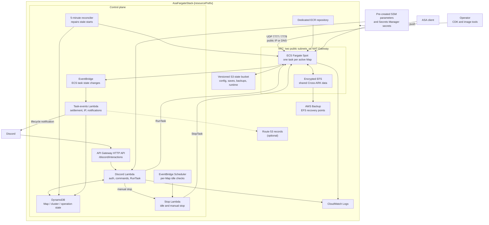

# ASA On Demand

AWS CDK v2 project for running private ARK: Survival Ascended servers on ECS Fargate Spot and operating them through Discord slash commands.

[日本語](./README.ja.md)

## Infrastructure Overview

One CloudFormation stack represents one isolated ASA cluster environment. It has no always-on ECS Service: a Discord command starts a Fargate task for the selected Map, and the task stops on request, idle timeout, or failure. Each active Map has its own task and S3 namespace; only Cross-ARK cluster data is shared through EFS.



### Component Responsibilities

| Area | Resources | Responsibility |
| --- | --- | --- |
| Entry point | API Gateway, Discord Lambda | Verify Discord signatures and authorization, defer commands, and coordinate start/stop/status operations. |
| Compute | ECS cluster, game task definition | Start one public-IP Fargate task for each active Map. Fargate Spot is preferred; on-demand fallback is opt-in. |
| Lifecycle | ECS events Lambda, stop Lambda, reconciler, Scheduler | Settle task state, publish connection details, perform idle stops, and recover stale start operations. |
| Persistent state | S3, DynamoDB, EFS | Store Map archives/runtime objects, control-plane state, and shared Cross-ARK data respectively. |
| Images | Dedicated ECR repository | Store the server image selected by `asaBuildId`; retain the two newest images. |
| Recovery | S3 versioning, AWS Backup | Preserve previous Map archives and take hourly/daily EFS recovery points. |
| Optional | Route 53, AWS Budgets | Publish `<mapId>.<domain>` records and send account cost alerts when explicitly enabled. |

### Runtime Lifecycle

1. `/asa start` atomically claims the Map and a cluster concurrency slot in DynamoDB.
2. The Discord Lambda starts a Fargate task with the selected Map, session settings, S3 keys, and stable `asaClusterId`.
3. The container restores that Map's save from S3, mounts shared Cross-ARK data from EFS, overlays common and Map-specific configuration, and starts ASA through Proton.
4. Runtime heartbeats and readiness files are written to the Map's S3 namespace. ECS task events update DynamoDB, optional DNS, and Discord notifications.
5. Manual stop or idle detection invokes the stop Lambda. The container saves the world before exit, and the task-events Lambda settles runtime and cost counters.

There is no load balancer or ECS Service. Clients connect directly to a task's public IP or its optional Route 53 record.

## Environment and State Boundaries

Use a simple `resourcePrefix` such as `main` for each independent environment. Do not include a Map name or a leading/trailing `/`; the application normalizes it to an internal S3 prefix. With `resourcePrefix=main`:

- the stack is `AsaFargateStack-main`;
- configuration is read from `/asa/main/...` in SSM and Secrets Manager;
- logs are under `/asa/main/...`;
- persistent objects use the following S3 layout.

```text
main/
├── config/
│   ├── common/                         # Applied to every Map
│   └── maps/<mapId>/                   # Map-specific overlay
├── maps/<mapId>/
│   ├── saves/current.tar.zst           # Current Map save; no Cross-ARK data
│   ├── backups/
│   └── runtime/                        # Heartbeat, readiness, backup requests
└── logs/
```

State ownership is intentionally split:

| State | Store | Scope |
| --- | --- | --- |
| Map world and local save data | S3 archive | One Map |
| Cross-ARK survivor/tribute data | Encrypted EFS | All Maps in one stack |
| Active task, operation, and runtime accounting | DynamoDB | One stack |
| Server image | ECR | One stack and build tag |

S3, EFS, DynamoDB, and the EFS backup vault are retained when the stack is destroyed. ECR images and CloudWatch log groups are disposable. S3 noncurrent versions expire after 7 days; EFS backups are hourly for 7 days and daily for 35 days by default.

Cross-stack transfers are not supported.

## Development Setup

Requirements: Node.js 22+, pnpm, Docker, AWS CLI credentials, and a Discord account that can install apps and create webhooks in the target server.

```bash
pnpm install
```

Use pnpm rather than npm for repository commands. The validation commands are listed under [Commands](#commands).

### Create and Install the Discord Application

Discord calls a server a *guild* in its API and in this repository.

1. Open the [Discord Developer Portal](https://discord.com/developers/applications), select **New Application**, enter a name, and create the application.
2. On **General Information**, copy the **Application ID** and **Public Key**. The **Interactions Endpoint URL** is left empty until the AWS stack has been deployed.
3. Open **Bot**. New applications already have a bot user; under **Token**, select **Reset Token** and copy the generated token. Discord displays it only when it is generated. Do not use the OAuth2 client secret, and never commit the bot token.
4. Open **Installation** and configure the application:
   - Enable **Guild Install**. This project does not use **User Install**.
   - Select **Discord Provided Link** for the install link.
   - Under **Default Install Settings** for **Guild Install**, add the `applications.commands` and `bot` scopes.
   - No bot permissions or privileged Gateway Intents are required. Commands arrive through the HTTP interactions endpoint, and lifecycle notifications use a webhook.
5. Copy the install link, open it in a browser, select **Add to server**, and choose the target server. Installing a server app requires the Discord **Manage Server** permission.
6. In the Discord client, enable **User Settings > Advanced > Developer Mode**. Right-click the target server and select **Copy Server ID**. For operators, right-click a member and select **Copy User ID**, or open **Server Settings > Roles** and copy a role ID. At least one of the allowed-user and allowed-role lists must contain an ID. See [Discord's ID guide](https://support.discord.com/hc/en-us/articles/206346498-Where-can-I-find-my-User-Server-Message-ID) if the copy actions are hidden.
7. Create the notification webhook separately from the application: open **Server Settings > Integrations > Webhooks**, select **Create Webhook**, choose the notification channel, and copy the webhook URL. Treat this URL as a secret. Discord's [webhook guide](https://support.discord.com/hc/en-us/articles/228383668-Intro-to-Webhooks) shows the same server-side flow.

The values collected above map to the configuration template as follows:

| Discord value | Template value | AWS destination |
| --- | --- | --- |
| Bot Token | `<discord bot token>` | Secrets Manager `/discord/bot-token` |
| Notification webhook URL | `<discord webhook url>` | Secrets Manager `/discord/notification-webhook-url` |
| Application ID | `<application id>` | SSM `/discord/application-id` |
| Public Key | `<public key>` | SSM `/discord/public-key` |
| Server ID | `<guild id>` | SSM `/discord/guild-id` |
| Role and user IDs | JSON arrays such as `["123456789012345678"]` | SSM `/discord/allowed-role-ids` and `/discord/allowed-user-ids` |

Keep the IDs as strings inside the JSON arrays. Complete the **Interactions Endpoint URL** and guild-command registration in [First Deployment](#first-deployment), after the endpoint and configuration exist.

## First Deployment

The example below creates an environment named `main`. Use the same profile, region, prefix, and build ID throughout the workflow. Command-line CDK context is not stored as environment configuration, so repeat every non-default context value on later deploys.

1. Bootstrap CDK once per account and region:

   ```bash
   pnpm exec cdk bootstrap --profile my-aws-profile -c region=ap-northeast-1
   ```

2. Deploy the infrastructure. The referenced image tag may be absent at this point because no ECS Service starts automatically:

   ```bash
   pnpm exec cdk deploy \
     --profile my-aws-profile \
     -c region=ap-northeast-1 \
     -c resourcePrefix=main \
     -c asaBuildId=BUILD_ID \
     -c monthlyBudgetJpy=1500 \
     -c monthlyRuntimeHoursLimit=80
   ```

3. Build and push the matching image to the stack's dedicated ECR repository:

   ```bash
   ./scripts/push-image.sh \
     --profile my-aws-profile \
     --region ap-northeast-1 \
     --resource-prefix main \
     --build-id BUILD_ID
   ```

4. Create secrets and parameters using the example as a template. Keep the populated copy under the gitignored `local/` directory:

   ```bash
   mkdir -p local
   cp scripts/put-secrets.example.sh local/put-secrets.sh
   RESOURCE_PREFIX=main ./local/put-secrets.sh --profile my-aws-profile
   ```

5. In the Discord Developer Portal, open the application's **General Information** page. Paste the `DiscordInteractionsEndpointUrl` stack output into **Interactions Endpoint URL** and save it. After Discord successfully verifies the endpoint, register the guild commands:

   ```bash
   pnpm run discord:register \
     --profile my-aws-profile \
     --resourcePrefix main
   ```

6. Run `/asa start` in the guild.

The image must exist before step 6. Discord credentials must exist before endpoint verification and command registration. A destroy/redeploy changes the API Gateway URL, so update the Developer Portal afterward.

## Configuration

For `resourcePrefix=main`, configuration lives under `/asa/main`. The stack grants access to these names but does not create their values.

| Store | Required suffixes |
| --- | --- |
| Secrets Manager | `/discord/bot-token`, `/discord/notification-webhook-url`, `/server/password`, `/server/admin-password` |
| SSM Parameter Store | `/discord/application-id`, `/discord/public-key`, `/discord/guild-id`, `/discord/allowed-role-ids`, `/discord/allowed-user-ids`, `/server/session-name`, `/server/default-map`, `/server/max-players` |

Optional SSM parameters:

- `/server/enabled-maps` restricts selectable Maps. Delete it to allow the shared Map registry, and re-run `pnpm run discord:register` whenever it changes.
- `/server/event-mod-id` supplies a numeric CurseForge project ID at task start. Restart an active server to apply a change.

Optional server configuration belongs in the state bucket:

```bash
aws s3 cp local/GameUserSettings.ini "s3://<AsaStateBucketName>/main/config/common/GameUserSettings.ini"
aws s3 cp local/Game.ini "s3://<AsaStateBucketName>/main/config/common/Game.ini"
aws s3 cp local/the-island/Game.ini "s3://<AsaStateBucketName>/main/config/maps/the-island/Game.ini"
```

Common configuration is applied first and the Map overlay second. Runtime-owned values such as passwords, ports, and session name are injected afterward.

## Operations

### Updating the Server Image

Build and push a new immutable tag:

```bash
./scripts/push-image.sh \
  --profile my-aws-profile \
  --region ap-northeast-1 \
  --resource-prefix main \
  --build-id BUILD_ID
```

Then repeat the full deploy command from [First Deployment](#first-deployment) with the new `asaBuildId`. Keep every other environment-specific context value unchanged. `asaUpdateOnStart=true` exists for emergency SteamCMD updates, but the normal path is a baked and tested image.

### Cost and Automatic Stop

- Every Map has its own idle timeout and heartbeat. Missing or stale heartbeats do not trigger a stop.
- The Lambda control plane enforces a monthly runtime-hours limit and reports conservative and Spot cost estimates.
- AWS Budgets email notifications are optional through `enableAwsBudget=true` and `budgetEmail`.
- Fargate on-demand fallback is disabled unless `enableOnDemandFallback=true` is set.

## Commands

```bash
pnpm run build                 # TypeScript check
pnpm run check                 # Lint and formatting rules
pnpm run test                  # Unit and CDK tests
pnpm run synth                 # CloudFormation synthesis
pnpm run smoke                 # Two-Map structural smoke test
ASA_TEST_IMAGE=ACCOUNT.dkr.ecr.ap-northeast-1.amazonaws.com/REPOSITORY:BUILD_ID pnpm run test:container
```

## Further Documentation

- [Legacy environment storage migration and rollback runbook](./docs/parallel-map-transfer-runbook.md) — only for environments created with the older single-save layout; new deployments require no migration.
- [Example secrets and parameters](./scripts/put-secrets.example.sh)
